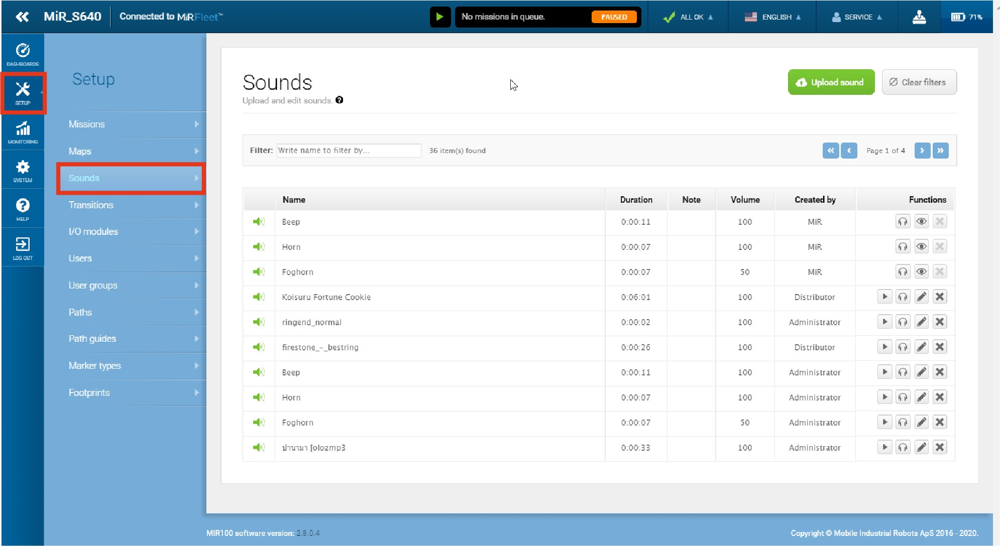
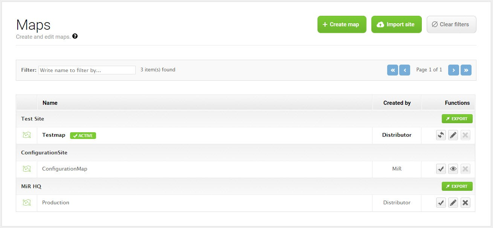

# MiR web interface
This is an overview of the MiR web interface. Here you will find the most common MiR web interface functions. This **is not** a complete how-to on the use of the web interface capabilities. For detailed information about the interface see the *MiR robot Reference Guide* pdf. 

To establish a connection to the MiR web interface see [Connect to `MiR100`](./mir_connection.md).

!!! warning
    `MiR100` internal clock is prone to desynchronization which can mess with the robot control.  
    First thing you have to do after you connect to the MiR web interface is go to `System -> Settings -> Date & Time` and synchronize the internal clock. Click `Load from device` and `Save changes`.

## Interface overview
### Top bar
The top bar shows information on the current state of the robot. You can start/pause the robot, check robot status, select you language, select your user, check the robot battery percentage or manually control the robot with the on screen joystick. Robot speed for manual control is fixed when using the joystick from the top bar. **This is not the recommended use of joystick. Use the [*FE_joysticks*](#example-dashboards) dashboard** 

### Navigation
To get to a specific subsection of the interface select an item in the primary menu and then in the relevant submenu.

## Interface menus
### Dashboards menu
Dashboards are the main way you interact with the robot over the web interface. A dashboard is made up of a
number of widgets, each representing a feature in the system, such as a particular mission, the map the robot is running in, or the current mission queue. You can create your own dashboard that displays only relevant information for your use case. The dashboard below includes a Mission queue, mission action log, two mission buttons, a joystick and the map.

##### Creating a dashboard
Select `Dashboards` to open the list of dashboards, and select the `Create dashboard` button to open the dashboard designer. Alternatively, you can select an existing dashboard from the list to edit. Design the dashboard by selecting widgets from the menus in the top bar. Resize the widgets by pulling the arrow in the lower right corner and rearrange their order by selecting and dragging them. Some widgets require further settings. For example, you must select a particular mission for mission buttons. To do this, select the pen icon in the lower left corner and select the wanted action.

##### Example dashboards
In the dashboards list you can find the *FE_standard* and *FE_joysticks* dashboards. *FE_standard* is a template for a standard use case and is a good starting place for designing your own. *FE_joysticks* is a dashboard that contains only joystick control widgets where each joystick has a different speed setting. This is practical for manual control of the robot where you want to use different speeds - slower for narrower areas, and faster for open space. The best way to use the joystick is to access the web interface on your phone and guide the robot with your finger.

<!-- TODO: joystick dashboard screenshot -->

### Setup menu
#### Missions submenu
A mission is a predefined series of actions that the robot can be set to perform. It can be a simple transportation task between defined positions or a more complex job. The robot will perform the missions in the order they are added, and an operator may rearrange the queued missions if needed.  

Missions are started by adding a mission to the mission queue and clicking on the continue button in the top bar or in the dashboard, if you add the pause/continue widget. The robot will perform the missions in the order they are added, and you can rearrange the queued missions if needed. You can enqueue a mission:

- from a dashboard: you can configure a mission button
- from the missions menu: in the mission list click on the green button next to the selected mission.

##### Creating a mission

A mission is made up of actions, such as: move actions, logic actions, docking actions and sounds, which can be put together to form a mission. Missions themselves can also be nested into other missions. Most actions have adjustable parameters, for example, which position to go to and can also use variables, enabling the user to choose the value of a parameter each time the mission is used. Access these parameters with the gear button.

To create a new mission select `Setup -> Missions -> Create mission` to open the mission designer. In the top bar you can choose the actions or missions that you want to add to the mission. You can drag and drop to rearrange the order. Actions are executed in a top-to-bottom order.

You can view all the possible actions in the *MiR robot Reference Guide*.

#### Maps submenu
In the Maps section, you create or edit the maps the robot uses to navigate by. All maps must belong to a site, which is the overall container for one or more maps used in the same facility. Maps must be contained in the same site for the robot to be able to move from one map to another. You can choose the active map by clicking the check mark next to the map on the map list. You can also create or edit the maps the robot uses. 

##### Creating a map
To create a new map select `Setup -> Maps -> Create map`. You are then directed to the map editor where you can start the mapping process and find tools to edit the map and add various features such as positions, markers and zones.

The built-in mapping functionality makes it possible to draw a map by manually driving the robot around the facility using the joystick while the robot uses the laser scanners to map the area. **When mapping the robot speed is fixed. Slowly move the joystick to get used to the speed.** You can create maps using two mapping [algorithms](#mapping-settings).

The map recording and editing tools are all found on the icon tool bar, and the drop-down list contains all the features you can add to your map. Different tools are displayed on the icon toolbar depending on which feature you have selected from the drop-down list.

Press the 3-dots icon to open the Upload, download and record map dialog box. This toolbar has options for recording a new map or uploading/downloading existing ones.

- **Upload and overwrite:** erases the existing map and replaces it with the map you upload
- **Upload and append:** adds the uploaded map to the existing one
- **Download map:** saves the map to your PC as a PNG file
- **Record and overwrite:** erases the existing map and replaces it with the map you record
- **Record and append:** adds the recorded map to the existing one

Select `Record and overwrite` or `Record and append` to start the mapping engine. A blinking icon indicates that the recording has started, and you can now activate the joystick and start moving the robot around the area. To stop the mapping engine, press the record icon in the upper-left corner of the recording window.

After the mapping engine stops, you can rotate the map and align it using the grid. When you finish the editing, select the check mark in the upper left-hand corner to save the map.

##### Edit the map
When the map recording is done, modify the map by removing unwanted "noise", adding virtual walls, preferred or unpreferred drive zones, positions, markers and other features.

The left side tool bar has the basic tools for saving, undoing, and navigating in the map you are working on. Furthermore, different tools appear on the tool bar depending on which map layer you select from the Object types drop-down list.

The Select object-list contains all features that you can add to the map, such as positions, markers, zones, walls, and floors. View all object descriptions in the *MiR robot Reference Guide*.

The right side tool bar has tools for controlling the map view and synchronizing the robot’s position with the map view.

Bellow is an image of a finished map. It contains multiple robot positions, a marker and two forbidden zones (red).

#### Other setup submenus
- **Sounds submenu:** you can upload new sounds to the robot or edit the volume and length of the uploaded sounds. Sounds can be used in missions as alerts.
- **Transitions submenu:** transitions are used to handle changeovers from one map to another within the same site. 
- **I/O modules submenu:** I/O modules (Bluetooth and WISE) are used for receiving and giving input and output to be able to communicate with external devices.
- **Users submenu:** set up, edit, and delete system users.
- **User groups submenu:** create user groups and assign permissions to
each group.
- **Paths submenu:** Paths are saved routes between two positions. The first time the robot runs the route between two positions, the calculated path is saved and used every time the robot runs the same route, thereby saving time for route calculation. A path is automatically recalculated only in the event that one of its positions is modified. You can delete a path, and the robot will then calculate a new path the next time it runs between those two positions.
- **Path guides submenu:** A path guide makes it possible to define paths that the robot should follow between two positions by defining waypoint positions between the start and goal. 
- **Footprints submenu:** A footprint defines the size of the robot and its top module or load.

### Monitoring menu
- **Analytics submenu:** gives a graphic overview of the robot's driven distance over a specified period of time.
- **System log submenu:** contains events that are logged by the operating system components. The system log contains information about system state at a given time (shown by color-codes), the affected module, a short explanation, and a time stamp.
- **Error logs submenu:** a list of all detected system errors. Each entry is shown with a description, an indication of which module is affected, and the time when the error occurred.
- **Hardware health submenu:** allows you to check the condition of the robot's hardware components, such as motor controllers, lasers scanners, and cameras.
- **Safety system submenu:** provides a live view of the input from the laser scanners and the state of the emergency stop button.
- **Mission log submenu:** contains the list of all missions that the robot has executed and the mission that is running now. 

### System menu
#### Settings submenu
Settings contains the robot's parameter settings where the settings are divided into sub groups. Here are some of the most important settings:

##### Mapping settings
- `Mapping -> Mapping algorithm`: the algorithm the robot uses for creating maps. Choose between *Hector* and *Carthographer* (default). The *Cartographer* method records multiple smaller maps and then compiles those into one map after the recording session. It is recommended to map in a circular pattern and closing loops. The *Hector* method records and compiles data in one map during the mapping. It is recommended to map in a branch pattern, while going back over your own tracks several times.

##### Planner settings
- `Planner -> Desired speed`: the desired default speed in m/s. This value can also be changed through a mission action.
- `Planner -> Maximum allowed speed`: the robot's maximum speed in m/s which cannot be exceeded no matter what is stated in missions, zones, or other settings.
- `Planner -> Cart reverse speed`: the speed in m/s of the robot when it is reversing with a cart.
- `Planner -> Maximum planning time`: the maximum time in seconds allocated for planning a path.
- `Planner -> Path timeout`: the number of seconds where the robot cannot follow the path before it generates a new global plan.
- `Planner -> Path deviation`: the maximum distance in meters that the robot's local plan is allowed to deviate from the global plan.

##### UR interface settings
- `UR interface -> Universal Robot IP address`: the IP address of the UR robot. Used with the [`MiRco` industrial interface control](../MiRco/mirco_start.md/#mirco-industrial-interface).

##### Features settings
- `Features -> Universal Robots Interface`: enable the running UR programs from inside MiR missions. Used with the [`MiRco` industrial interface control](../MiRco/mirco_start.md/#mirco-industrial-interface).

##### WiFi settings
- `WiFi -> Add connection`: used to connect `MiR100` to an outside network. Select the network you wish to connect and fill in the required information. `MiR100_IP` is displayed under the network connection details. When the user and `MiR100` are connected to the same outside network, you can use this IP to access the web interface.

##### Date & Time settings
- `Date&Time -> Load from device -> Save changes`: synchronize the internal clock. Since the internal clock is prone to desynchronization **this needs to be done on every boot**.

#### Other system submenus
- **Processes submenu:** displays the software modules that control the system processes on the robot.
- **PLC registers submenu:** registers can be accessed through a serial interface using the robot’s USB port (via RS232 adapter) or through a REST interface using the robot’s Ethernet connection. 
- **Software versions submenu:** you can update the robot to run the newest
software and see a list of all previous versions installed on the robot
-  **Backups submenu:** copies of the configuration and system state data of your robot
- **Robot setup submenu:** contains the robot configuration and calibration properties.
- **Triggers submenu:** yhe robot can be set up to use Modbus TCP/IP communication. In the Triggers section you can set up links between robot missions and Modbus coil IDs

### Help menu
- **Robot information submenu:** contains robot information.
- **API documentation submenu:** All functionality found in the robot interface can also be accessed through the robot's REST API. The REST API is what the robot interface uses to communicate with the robot. Here you can try the REST API. Enter your username and password and then select *Launch API* documentation. Each endpoint you can use is documented, and you can select *Try it out* to send an API request using the entered authorization. We also made a [python REST API](./mir_rest_api.md) for the MiRco robot.
- **Remote access submenu:** MiR Technical Support team remote access.
- **Service book submenu:** notes about the robot.
- **Manual submenu:** copy of the reference guide.

## Control the robot
### Send to goal
<!-- TODO:check these instruction -->

The main way to control `MiR100` is through missions, however you can also send the robot to individual goals.  

- Send to target: use the map to send `MiR100` to a goal not predefined (as a position or marker) on the active map. Click on the position on the map and use your mouse to set the orientation
- Send to position: select the chosen position on the active map and select `Go TO`
- Send to marker: select the chosen marker on the active map and select `Go TO`

Each of these command will add an action to the mission queue. You can append them or overwrite the queue.

### Manual control
The easiest way to move `MiR100` to a desired goal is to manually control the robot.

The web interface has an onscreen joystick in the top bar of the interface but as mentioned, this is not the recommended method since the robot speed when using the top bar joystick is fixed. This can cause problems in narrow areas. Instead use the *FE_joysticks* [dashboard](#example-dashboards) - it includes multiple onscreen joystick widgets with different speeds. 

The best way to use the joystick is to access the web interface on your phone and guide the robot with your finger.

