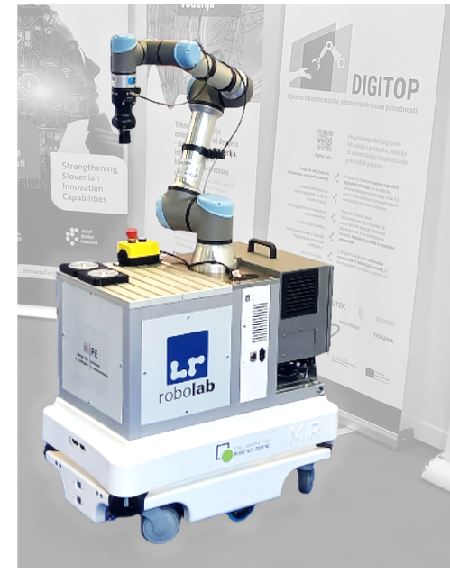

# MiRco documentation
**NOTE: this documentation is currently under development.**

<!--  -->

This documentation contains instructions for working with the `MiRco` mobile manipulator.  
`MiRco` consists of `MiR100` mobile base, `UR5e` manipulator arm and `Robotiq 2F-85`  gripper.

## Tested on
-  `MiR100` robot:
    - software version 2.13.3.2
- `UR5e` manipulator:
    - TODO
- `Robotiq 2F-85` gripper
    - TODO

## Acknowledgements
- Thank you to the [DFKI](https://github.com/DFKI-NI) team for developing and maintaining the ROS [`mir_robot`](https://github.com/DFKI-NI/mir_robot) package.
- Thank you to the [UniversalRobots](https://github.com/UniversalRobots) team for developing and maintaining the ROS [`Universal_Robots_ROS_Driver`](https://github.com/UniversalRobots/Universal_Robots_ROS_Driver) package.
- Thank you to the [TAMS-Group](https://github.com/TAMS-Group) team for maintaining the ROS [`Robotiq`](https://github.com/TAMS-Group/robotiq) package.
